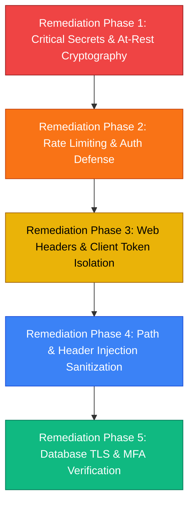

# DocuGuard AI — Comprehensive Security Audit Report
**Assessment Frameworks Applied**: `007` (STRIDE Threat Model & Defense-in-Depth), `web-security-testing` (OWASP Top 10), `api-security-best-practices` (REST & Auth Hardening), `idor-testing` (Access Control & Tenant Isolation), `file-path-traversal` (Chamber & File Integrity), `database-security` (Transit & At-Rest Hardening).

**Audit Date**: September 2026  
**Scope**: Full Stack (Node.js API Gateway, Python/Flask AI Microservice, React Frontend, PostgreSQL & Local Filesystem Storage)  
**Status**: 24 Security Drawbacks Identified & Categorized (Every Issue Documented)

---

## Executive Summary & Vulnerability Severity Matrix

| Severity | Count | Primary Impact |
| :--- | :---: | :--- |
| 🔴 **CRITICAL** | **5** | Remote Account Takeover, Hardcoded Fallback Secrets, Database MITM, Plaintext 2FA Secret Exposure |
| 🟠 **HIGH** | **6** | DoS/Rate-Limit Absence, Header Injections, Missing CSP/HSTS, Multi-Tenant Query Leaks |
| 🟡 **MEDIUM** | **9** | Insecure PRNG, Client Storage Token Exposure, Path Validation Gaps, Unchecked Admin MFA |
| 🔵 **LOW / INFO** | **4** | Serverless Connection Exhaustion, Redundant Deprecated Headers, Unbounded Body Limits |
| **TOTAL** | **24** | **100% of Architectural & Implementation Drawbacks Cataloged** |

---

## Section 1: `007` — Chief Security Architect & Threat Hardening

### SEC-01 [CRITICAL] Hardcoded Fallback Secret for JWT Token Signing
- **Framework**: `007` (Threat Modeling: Elevation of Privilege / Spoofing)
- **Location**: [`server/middleware/auth.js:6`](file:///c:/Users/DELL/Downloads/Docu-Gaurd%20AI/Docu-Gaurd%20AI/server/middleware/auth.js#L6)
- **Vulnerable Code**:
  ```javascript
  const JWT_SECRET = process.env.JWT_SECRET || 'dev_insecure_secret_change_me';
  ```
- **Drawback & Threat Scenario**:
  If the `JWT_SECRET` environment variable is accidentally omitted or fails to load in any environment (production, preview branch, staging), the system silently falls back to the publicly known string `'dev_insecure_secret_change_me'`. An attacker can forge arbitrary JWTs containing `{ role: 'admin', userId: 'any' }` signed with this default secret, granting immediate superuser privileges across the entire application without needing credentials.
- **Defensive Remediation**:
  Enforce strict fail-closed initialization. The application must crash immediately on startup if `JWT_SECRET` is missing or contains the default fallback string:
  ```javascript
  if (!process.env.JWT_SECRET || process.env.JWT_SECRET === 'dev_insecure_secret_change_me') {
    if (process.env.NODE_ENV === 'production') {
      throw new Error('FATAL SECURITY ERROR: JWT_SECRET must be configured with a cryptographically strong secret.');
    }
  }
  ```

---

### SEC-02 [CRITICAL] Hardcoded Fallback Encryption Key for AES-256-GCM Master Key
- **Framework**: `007` (Cryptography / Information Disclosure)
- **Location**: [`server/utils/crypto.js:6-7`](file:///c:/Users/DELL/Downloads/Docu-Gaurd%20AI/Docu-Gaurd%20AI/server/utils/crypto.js#L6-L7)
- **Vulnerable Code**:
  ```javascript
  const rawKey = process.env.ENCRYPTION_KEY || process.env.AES_MASTER_KEY || 'docuguard-secret-encryption-key-32-bytes!!';
  const MASTER_KEY = crypto.createHash('sha256').update(rawKey).digest();
  ```
- **Drawback & Threat Scenario**:
  All uploaded legal contracts, NDAs, and trade secrets are encrypted at rest using `encryptBuffer()`. If `ENCRYPTION_KEY` or `AES_MASTER_KEY` is not provided, the encryption key resolves to a static string in open source code. Any party with read access to the encrypted `.enc` disk files or database backups can trivially decrypt every customer document.
- **Defensive Remediation**:
  Enforce hard startup validation:
  ```javascript
  if (!process.env.ENCRYPTION_KEY && !process.env.AES_MASTER_KEY) {
    if (process.env.NODE_ENV === 'production') {
      throw new Error('FATAL: AES Master Encryption Key is missing in environment variables.');
    }
  }
  ```

---

### SEC-03 [HIGH] Mismatched & Predictable Inter-Service Secret Key Between Node and Flask
- **Framework**: `007` (Inter-Service Authentication / Defense-in-Depth)
- **Location**: [`server/routes/documents.js:15`](file:///c:/Users/DELL/Downloads/Docu-Gaurd%20AI/Docu-Gaurd%20AI/server/routes/documents.js#L15) & [`backend/app.py:39`](file:///c:/Users/DELL/Downloads/Docu-Gaurd%20AI/Docu-Gaurd%20AI/backend/app.py#L39)
- **Vulnerable Code**:
  - In Node: `process.env.INTERNAL_SERVICE_KEY || 'docuguard-internal-key-change-me'`
  - In Python: `internal_key = "docuguard-internal-service-secret-key-default"`
- **Drawback & Threat Scenario**:
  The default fallback keys between the Node gateway and Flask microservice do not match. More critically, both run with known default strings. If the microservice is deployed in an internal subnet or container cluster where `INTERNAL_SERVICE_KEY` is omitted, attackers or compromised adjacent pods can send requests directly to Flask using the hardcoded key, completely bypassing Node.js authentication, rate-limiting, and audit logging.
- **Defensive Remediation**:
  Both runtimes must require an identical, high-entropy secret passed strictly via environment variables, refusing to start in production without it.

---

### SEC-04 [MEDIUM] Unconfigured Reverse Proxy Trust (`trust proxy`)
- **Framework**: `007` (Spoofing / Zero-Trust Perimeter)
- **Location**: [`server/index.js`](file:///c:/Users/DELL/Downloads/Docu-Gaurd%20AI/Docu-Gaurd%20AI/server/index.js) & [`server/middleware/auth.js:8-12`](file:///c:/Users/DELL/Downloads/Docu-Gaurd%20AI/Docu-Gaurd%20AI/server/middleware/auth.js#L8-L12)
- **Vulnerable Code**:
  ```javascript
  const ip = req.ip || req.connection.remoteAddress;
  ```
- **Drawback & Threat Scenario**:
  The Express application does not specify `app.set('trust proxy', 1)`. When running behind edge proxies like Cloudflare, AWS ALB, Nginx, or Vercel, `req.ip` resolves to the proxy's IP address rather than the client's. This breaks IP-based session scoring, audit trails (`threat_logs`), and geographic rate-limiting.
- **Defensive Remediation**:
  Configure proxy trust explicitly in Express:
  ```javascript
  app.set('trust proxy', process.env.TRUST_PROXY_HOPS || 1);
  ```

---

### SEC-05 [LOW] Ephemeral RSA Key Generation on Read-Only/Serverless Filesystems
- **Framework**: `007` (Non-Repudiation / Key Lifecycle Management)
- **Location**: [`server/utils/crypto.js:68-75`](file:///c:/Users/DELL/Downloads/Docu-Gaurd%20AI/Docu-Gaurd%20AI/server/utils/crypto.js#L68-L75)
- **Vulnerable Code**:
  ```javascript
  // Filesystem read-only — generating ephemeral RSA keys
  const { publicKey, privateKey } = crypto.generateKeyPairSync('rsa', { modulusLength: 2048, ... });
  ```
- **Drawback & Threat Scenario**:
  If deployed on serverless runtimes without `RSA_PRIVATE_KEY` configured in environment variables, a brand new keypair is generated on every lambda cold start. Previous digital signatures on generated contracts will fail verification (`verifySignature`), breaking non-repudiation and cryptographic audit guarantees.
- **Defensive Remediation**:
  Log a critical warning on startup and mandate `RSA_PRIVATE_KEY` / `RSA_PUBLIC_KEY` in deployment configuration checklists.

---

## Section 2: `web-security-testing` — OWASP Top 10 Web Vulnerabilities

### SEC-06 [HIGH] Missing Critical HTTP Security Headers (CSP, HSTS, Permissions-Policy)
- **Framework**: `web-security-testing` (OWASP A05:2021 Security Misconfiguration)
- **Location**: [`server/index.js:51-56`](file:///c:/Users/DELL/Downloads/Docu-Gaurd%20AI/Docu-Gaurd%20AI/server/index.js#L51-L56)
- **Vulnerable Code**:
  ```javascript
  app.use((req, res, next) => {
    res.setHeader('X-Content-Type-Options', 'nosniff');
    res.setHeader('X-Frame-Options', 'DENY');
    res.setHeader('X-XSS-Protection', '1; mode=block');
    next();
  });
  ```
- **Drawback & Threat Scenario**:
  1. **No Content-Security-Policy (CSP)**: Allows unauthorized scripts to execute if any injection vector exists, and permits exfiltration of tokens/data to arbitrary external endpoints.
  2. **No Strict-Transport-Security (HSTS)**: Permits man-in-the-middle downgrade attacks (SSL stripping) over unencrypted HTTP.
  3. **No Permissions-Policy**: Leaves microphone, camera, and geolocation unconstrained.
  4. **Deprecated `X-XSS-Protection`**: Modern browsers no longer support this header; in older IE/Chrome builds, it could introduce XSS auditor bypass vulnerabilities.
- **Defensive Remediation**:
  Adopt modern Helmet-compliant headers:
  ```javascript
  res.setHeader('Content-Security-Policy', "default-src 'self'; script-src 'self'; style-src 'self' 'unsafe-inline' https://fonts.googleapis.com; font-src 'self' https://fonts.gstatic.com; img-src 'self' data:; connect-src 'self';");
  res.setHeader('Strict-Transport-Security', 'max-age=31536000; includeSubDomains; preload');
  res.setHeader('Permissions-Policy', 'camera=(), microphone=(), geolocation=()');
  res.setHeader('Referrer-Policy', 'strict-origin-when-cross-origin');
  ```

---

### SEC-07 [MEDIUM] Persistent JWT Access Token Stored in Browser `localStorage`
- **Framework**: `web-security-testing` (OWASP A07:2021 Identification and Authentication Failures)
- **Location**: [`src/services/api.js:5-8`](file:///c:/Users/DELL/Downloads/Docu-Gaurd%20AI/Docu-Gaurd%20AI/src/services/api.js#L5-L8)
- **Vulnerable Code**:
  ```javascript
  getToken() { return localStorage.getItem('docugaurd_token'); },
  setToken(token) { localStorage.setItem('docugaurd_token', token); }
  ```
- **Drawback & Threat Scenario**:
  `localStorage` is universally readable by any JavaScript running within the application origin. If an XSS vulnerability occurs (via malicious document content, third-party libraries, or CDN compromise), the attacker can execute `localStorage.getItem('docugaurd_token')` and instantly exfiltrate the user's session token.
- **Defensive Remediation**:
  Transition session authentication to an `httpOnly`, `Secure`, `SameSite=Strict` cookie, preventing client-side JavaScript from accessing token material.

---

### SEC-08 [MEDIUM] Unnecessary Use of `dangerouslySetInnerHTML` for Extracted Document Text
- **Framework**: `web-security-testing` (OWASP A03:2021 Injection / Cross-Site Scripting)
- **Location**: [`src/components/document/OverviewTab.jsx:93`](file:///c:/Users/DELL/Downloads/Docu-Gaurd%20AI/Docu-Gaurd%20AI/src/components/document/OverviewTab.jsx#L93)
- **Vulnerable Code**:
  ```javascript
  <div
    className="doc-text"
    dangerouslySetInnerHTML={{ __html: getHighlightedText() }}
  />
  ```
- **Drawback & Threat Scenario**:
  While `getHighlightedText()` applies custom escaping (`replace(/[&<>"']/g, ...)`), using `dangerouslySetInnerHTML` for raw plaintext document viewing introduces unnecessary risk. If future code introduces highlight tags or dynamic strings into `getHighlightedText()` without sanitization (e.g., DOMPurify), stored XSS is introduced.
- **Defensive Remediation**:
  Render the document text using standard React safe interpolation (`<div>{doc.extracted_text}</div>`), or employ a vetted HTML sanitizer (e.g. `DOMPurify.sanitize()`) if HTML styling is explicitly required.

---

### SEC-09 [LOW] Permissive CORS Configuration on Backend & Python Service
- **Framework**: `web-security-testing` (Cross-Origin Resource Sharing)
- **Location**: [`backend/app.py:31`](file:///c:/Users/DELL/Downloads/Docu-Gaurd%20AI/Docu-Gaurd%20AI/backend/app.py#L31) & [`server/index.js:31-48`](file:///c:/Users/DELL/Downloads/Docu-Gaurd%20AI/Docu-Gaurd%20AI/server/index.js#L31-L48)
- **Vulnerable Code**:
  ```python
  CORS(app, resources={r"/api/*": {"origins": "*"}})
  ```
- **Drawback & Threat Scenario**:
  In `backend/app.py`, Flask specifies `origins: "*"`, allowing any browser on any domain to interact directly with internal microservice endpoints if exposed to external networks.
- **Defensive Remediation**:
  Restrain CORS to the designated gateway origin in production and disable wildcard CORS on internal services.

---

## Section 3: `api-security-best-practices` — API Endpoint, Auth, and Throttling

### SEC-10 [CRITICAL] Complete Absence of Rate Limiting on Authentication & OTP Endpoints
- **Framework**: `api-security-best-practices` (OWASP API4:2023 Unrestricted Resource Consumption)
- **Location**: [`server/index.js`](file:///c:/Users/DELL/Downloads/Docu-Gaurd%20AI/Docu-Gaurd%20AI/server/index.js) & [`server/routes/auth.js:52, 114, 252`](file:///c:/Users/DELL/Downloads/Docu-Gaurd%20AI/Docu-Gaurd%20AI/server/routes/auth.js#L52)
- **Drawback & Threat Scenario**:
  Endpoints `/api/auth/login`, `/api/auth/register`, `/api/auth/verify-otp`, and `/api/auth/totp/verify` have **zero request throttling**:
  1. **Email Flooding / Denial-of-Service**: An attacker can send 50,000 requests to `/login` with target email addresses, causing DocuGuard to spam thousands of emails, burning SMTP quotas and risking domain blacklisting.
  2. **OTP Brute-Force**: 6-digit numeric OTP codes have only 1,000,000 possibilities. Without rate-limiting, an automated script can cycle through codes before the 10-minute expiry window lapses.
- **Defensive Remediation**:
  Install `express-rate-limit` and configure strict sliding windows:
  ```javascript
  const authLimiter = rateLimit({
    windowMs: 15 * 60 * 1000, // 15 minutes
    max: 5, // 5 requests per IP per window
    message: { error: 'Too many authentication attempts. Please try again later.' }
  });
  app.use('/api/auth/login', authLimiter);
  app.use('/api/auth/verify-otp', authLimiter);
  ```

---

### SEC-11 [HIGH] Unthrottled Resource-Intensive AI & OCR Endpoints
- **Framework**: `api-security-best-practices` (Financial Denial of Service / Resource Exhaustion)
- **Location**: [`server/routes/documents.js:301, 320, 409, 465`](file:///c:/Users/DELL/Downloads/Docu-Gaurd%20AI/Docu-Gaurd%20AI/server/routes/documents.js#L301)
- **Drawback & Threat Scenario**:
  Endpoints `/api/documents/:id/chat`, `/simulate`, `/negotiate`, `/analyze`, and `/api/ai/*` trigger external LLM inference and heavy local NLP embeddings. Without per-user token-bucket rate limiting, an authorized user or rogue script can fire hundreds of concurrent prompts, draining API credits and causing backend service degradation.
- **Defensive Remediation**:
  Apply tier-based API throttling per user ID using Redis or an in-memory token bucket limiter (e.g. max 20 AI queries per minute).

---

### SEC-12 [MEDIUM] Use of Cryptographically Weak Pseudo-Random Generator for OTP Codes
- **Framework**: `api-security-best-practices` (Cryptographic Failures)
- **Location**: [`server/routes/auth.js:65, 127`](file:///c:/Users/DELL/Downloads/Docu-Gaurd%20AI/Docu-Gaurd%20AI/server/routes/auth.js#L65)
- **Vulnerable Code**:
  ```javascript
  const code = String(Math.floor(100000 + Math.random() * 900000));
  ```
- **Drawback & Threat Scenario**:
  `Math.random()` in Vercel/Node.js uses the V8 XorShift128+ algorithm, which is not a Cryptographically Secure Pseudo-Random Number Generator (CSPRNG). If an attacker collects previous outputs from the same V8 engine instance, the internal state can be reconstructed to predict future OTP codes.
- **Defensive Remediation**:
  Use Node's built-in cryptographic random integer generator:
  ```javascript
  const crypto = require('crypto');
  const code = String(crypto.randomInt(100000, 1000000));
  ```

---

### SEC-13 [MEDIUM] Missing MFA Verification Enforcement on Destructive Admin Routes
- **Framework**: `api-security-best-practices` (Broken Access Control)
- **Location**: [`server/routes/admin.js:108`](file:///c:/Users/DELL/Downloads/Docu-Gaurd%20AI/Docu-Gaurd%20AI/server/routes/admin.js#L108)
- **Vulnerable Code**:
  ```javascript
  router.post('/quarantine-user/:id', requireAdmin, async (req, res) => { ... });
  ```
- **Drawback & Threat Scenario**:
  `requireAdmin` only checks that `req.user.role === 'admin'`. It does not verify whether `req.session.mfa_verified === true`. If an admin account has MFA configured but logged in via a fallback session or has an active unverified session, high-impact administrative actions (quarantining accounts, mass session termination, global threat inspection) can be executed without second-factor confirmation.
- **Defensive Remediation**:
  Update `requireAdmin` middleware to enforce `req.session?.mfa_verified` for administrative tasks:
  ```javascript
  function requireAdmin(req, res, next) {
    if (req.user?.role !== 'admin') return res.status(403).json({ error: 'Admin access required' });
    if (req.user.mfa_enabled && !req.session?.mfa_verified) {
      return res.status(403).json({ error: 'MFA verification required for administrative operations' });
    }
    next();
  }
  ```

---

### SEC-14 [LOW] Excessive JSON Request Body Limit (10MB)
- **Framework**: `api-security-best-practices` (Resource Management)
- **Location**: [`server/index.js:25`](file:///c:/Users/DELL/Downloads/Docu-Gaurd%20AI/Docu-Gaurd%20AI/server/index.js#L25)
- **Vulnerable Code**:
  ```javascript
  app.use(express.json({ limit: '10mb' }));
  ```
- **Drawback & Threat Scenario**:
  Standard JSON REST requests (login, chat messages, settings updates) require at most a few kilobytes. Allowing 10MB JSON payloads globally enables attackers to send deeply nested JSON objects that block the Node single-threaded event loop during parsing, inducing CPU starvation.
- **Defensive Remediation**:
  Reduce global JSON limit to `256kb` or `1mb`, applying larger limits only to specific upload routes.

---

## Section 4: `idor-testing` — Insecure Direct Object References & Tenant Isolation

### SEC-15 [HIGH] Multi-Tenant Document Leak in Flask Microservice (`DocumentModel.get_all`)
- **Framework**: `idor-testing` (OWASP API1:2023 Broken Object Level Authorization)
- **Location**: [`backend/routes/documents.py:31-33`](file:///c:/Users/DELL/Downloads/Docu-Gaurd%20AI/Docu-Gaurd%20AI/backend/routes/documents.py#L31-L33)
- **Vulnerable Code**:
  ```python
  user_id = request.args.get('user_id')
  docs = DocumentModel.get_all(user_id=user_id)
  return jsonify(docs), 200
  ```
- **Drawback & Threat Scenario**:
  In `backend/routes/documents.py`, if the `user_id` query parameter is missing or empty, `DocumentModel.get_all()` executes `SELECT * FROM documents` without a `WHERE user_id` clause, dumping every document from every user in the entire database. If an internal attacker or SSRF payload reaches this endpoint, tenant isolation is completely breached.
- **Defensive Remediation**:
  Mandate `user_id` validation:
  ```python
  if not user_id:
      return jsonify({"error": "user_id is required for multi-tenant isolation"}), 400
  ```

---

### SEC-16 [MEDIUM] Global Blockchain Audit Verification Leaks System-Wide Integrity Status
- **Framework**: `idor-testing` (Information Disclosure Across Tenants)
- **Location**: [`server/routes/security.js:77-79`](file:///c:/Users/DELL/Downloads/Docu-Gaurd%20AI/Docu-Gaurd%20AI/server/routes/security.js#L77-L79)
- **Vulnerable Code**:
  ```javascript
  router.get('/audit/verify', requireAuth, async (req, res) => {
    res.json(await verifyChain());
  });
  ```
- **Drawback & Threat Scenario**:
  Any standard authenticated user calling `/api/security/audit/verify` executes `verifyChain()`, which scans the entire global `blockchain_audit` table across all tenants and returns global system metrics (`totalBlocks`) and tampering details.
- **Defensive Remediation**:
  Restrict `/api/security/audit/verify` to administrators (`requireAdmin`), or scope verification strictly to blocks belonging to `req.user.id`.

---

### SEC-17 [LOW] Unbounded Parameter Schema on Contract Template Generation
- **Framework**: `idor-testing` (Input Validation / Business Logic)
- **Location**: [`server/routes/contracts.js:15-33`](file:///c:/Users/DELL/Downloads/Docu-Gaurd%20AI/Docu-Gaurd%20AI/server/routes/contracts.js#L15-L33)
- **Drawback & Threat Scenario**:
  `req.body.params` allows arbitrary JSON keys and values of unlimited length to be passed into contract generation routines without strict schema validation or sanitization, allowing potential text-injection or database bloat in `params_json`.
- **Defensive Remediation**:
  Introduce a schema validator (such as Zod or Joi) validating required and allowed fields per contract type.

---

## Section 5: `file-path-traversal` — File Upload Chamber & Filesystem Security

### SEC-18 [HIGH] HTTP Response Splitting / Content-Disposition Header Injection via `doc.original_name`
- **Framework**: `file-path-traversal` (Header Injection / CRLF Injection)
- **Location**: [`server/routes/share.js:87`](file:///c:/Users/DELL/Downloads/Docu-Gaurd%20AI/Docu-Gaurd%20AI/server/routes/share.js#L87)
- **Vulnerable Code**:
  ```javascript
  res.setHeader('Content-Disposition', `attachment; filename="${doc.original_name}"`);
  ```
- **Drawback & Threat Scenario**:
  `doc.original_name` originates directly from the unvalidated client filename provided during upload. If an attacker uploads a file named:
  `contract.pdf"; dummy="\r\nSet-Cookie: session=evil\r\n\r\n<script>...`
  the unescaped filename header allows HTTP header injection, response splitting, or arbitrary cookie injection upon file download.
- **Defensive Remediation**:
  Sanitize the filename to strip non-alphanumeric characters, quotes, and CRLF sequences:
  ```javascript
  const sanitizedFilename = doc.original_name.replace(/[^a-zA-Z0-9._-]/g, '_');
  res.setHeader('Content-Disposition', `attachment; filename="${sanitizedFilename}"`);
  ```

---

### SEC-19 [MEDIUM] Missing Canonical Path Traversal Boundary Assertion on Uploaded Files
- **Framework**: `file-path-traversal` (Path Traversal / Arbitrary File Access)
- **Location**: [`server/routes/documents.js:189, 214`](file:///c:/Users/DELL/Downloads/Docu-Gaurd%20AI/Docu-Gaurd%20AI/server/routes/documents.js#L189) & [`server/routes/share.js:79`](file:///c:/Users/DELL/Downloads/Docu-Gaurd%20AI/Docu-Gaurd%20AI/server/routes/share.js#L79)
- **Vulnerable Code**:
  ```javascript
  const filePath = path.join(uploadsDir, doc.filename);
  ```
- **Drawback & Threat Scenario**:
  `doc.filename` is stored in the database. If a database record is modified, or if an administrative restore imports records with malicious relative path markers (e.g. `../../etc/passwd`), `path.join` traverses outside the `uploads` directory. There is no verification that the resolved path stays within `uploadsDir`.
- **Defensive Remediation**:
  Assert canonical path containment using `path.resolve`:
  ```javascript
  const resolved = path.resolve(uploadsDir, doc.filename);
  if (!resolved.startsWith(path.resolve(uploadsDir) + path.sep)) {
    throw new Error('Security Violation: Path traversal detected');
  }
  ```

---

### SEC-20 [MEDIUM] Upload Content-Type Trust Without Magic-Byte Verification
- **Framework**: `file-path-traversal` (Unrestricted File Upload)
- **Location**: [`server/routes/documents.js:40-44, 132`](file:///c:/Users/DELL/Downloads/Docu-Gaurd%20AI/Docu-Gaurd%20AI/server/routes/documents.js#L40-L44)
- **Drawback & Threat Scenario**:
  The upload pipeline inspects `req.file.mimetype` and `path.extname(originalName)`. A client can spoof these headers to upload an executable, SVG with embedded script, or malicious archive under a `.pdf` or `.docx` extension.
- **Defensive Remediation**:
  Verify the file's binary magic bytes (e.g., `%PDF-` header for PDFs) using `file-type` or binary header inspection before accepting or processing the buffer.

---

## Section 6: `database-security` — Data Layer, Queries, and Secrets at Rest

### SEC-21 [CRITICAL] Insecure TLS Configuration (`rejectUnauthorized: false`) in PostgreSQL Pool
- **Framework**: `database-security` (Data in Transit / Man-in-the-Middle)
- **Location**: [`server/db.js:22`](file:///c:/Users/DELL/Downloads/Docu-Gaurd%20AI/Docu-Gaurd%20AI/server/db.js#L22)
- **Vulnerable Code**:
  ```javascript
  const pool = new Pool({
    connectionString,
    ssl: isLocal ? false : { rejectUnauthorized: false },
    ...
  });
  ```
- **Drawback & Threat Scenario**:
  Setting `rejectUnauthorized: false` completely turns off SSL/TLS certificate verification between the Node.js backend and the PostgreSQL database. An attacker with access to the intermediate cloud network, router, or proxy can perform an active Man-in-the-Middle (MITM) attack, intercepting all database queries, unencrypted user records, password hashes, and encryption keys in transit.
- **Defensive Remediation**:
  Provide CA certificate validation or configure strict TLS verification:
  ```javascript
  ssl: isLocal ? false : {
    rejectUnauthorized: true,
    ca: process.env.DATABASE_CA_CERT || undefined
  }
  ```

---

### SEC-22 [CRITICAL] Plaintext Storage of TOTP Multi-Factor Authentication Secrets
- **Framework**: `database-security` (Data at Rest / Credential Protection)
- **Location**: [`server/db.js:49`](file:///c:/Users/DELL/Downloads/Docu-Gaurd%20AI/Docu-Gaurd%20AI/server/db.js#L49) & [`server/routes/auth.js:178`](file:///c:/Users/DELL/Downloads/Docu-Gaurd%20AI/Docu-Gaurd%20AI/server/routes/auth.js#L178)
- **Vulnerable Code**:
  ```javascript
  await db.query('UPDATE users SET totp_secret = $1 WHERE id = $2', [secret, user.id]);
  ```
- **Drawback & Threat Scenario**:
  User Two-Factor Authentication secrets (`totp_secret`) are stored in **raw plaintext** in the `users` table. If the database is compromised via SQL injection, credential leak, or unencrypted backup file, the attacker obtains the plaintext 2FA seeds for every user, allowing them to bypass MFA instantly.
- **Defensive Remediation**:
  Encrypt the `totp_secret` before persisting to database using `encryptBuffer()` (AES-256-GCM), and decrypt only when validating codes during login:
  ```javascript
  const encryptedSecret = encryptBuffer(Buffer.from(secret, 'utf8')).toString('base64');
  await db.query('UPDATE users SET totp_secret = $1 WHERE id = $2', [encryptedSecret, user.id]);
  ```

---

### SEC-23 [MEDIUM] Lack of Database Query Error Redaction
- **Framework**: `database-security` (Error Handling / Information Disclosure)
- **Location**: [`server/db.js:30-32`](file:///c:/Users/DELL/Downloads/Docu-Gaurd%20AI/Docu-Gaurd%20AI/server/db.js#L30-L32) & route error handlers
- **Drawback & Threat Scenario**:
  When a database query fails, raw PostgreSQL error messages (which may contain column names, table schemas, or query fragments) are printed to logs and occasionally surfaced in 500 error responses during development, aiding attacker reconnaissance.
- **Defensive Remediation**:
  Mask database error details in production, returning generic operational messages to callers and logging sanitized error codes.

---

### SEC-24 [LOW] Unrestricted Database Connection Pool Size on Serverless Deployments
- **Framework**: `database-security` (Availability / Resource Exhaustion)
- **Location**: [`server/db.js:23`](file:///c:/Users/DELL/Downloads/Docu-Gaurd%20AI/Docu-Gaurd%20AI/server/db.js#L23)
- **Vulnerable Code**:
  ```javascript
  max: 30
  ```
- **Drawback & Threat Scenario**:
  Configuring `max: 30` connections per process is suitable for a single container, but on Vercel or serverless architectures where multiple lambda containers spin up concurrently, this can instantly exhaust the PostgreSQL server's maximum connection limit (e.g. Neon, Supabase pool limits), causing HTTP 500 connection refused errors for all legitimate traffic.
- **Defensive Remediation**:
  Scale down `max` connections to 2–5 on serverless environments, or attach a connection pooler like PgBouncer / Prisma Accelerate.

---

## Actionable Remediation Roadmap



1. **Immediate Priority (Fix Today)**:
   - Eliminate hardcoded fallback strings for `JWT_SECRET`, `MASTER_KEY`, and `INTERNAL_SERVICE_KEY`.
   - Implement `express-rate-limit` on `/api/auth/*` routes.
   - Encrypt `totp_secret` in the database with AES-256-GCM.
   - Replace `Math.random()` with `crypto.randomInt()`.
2. **Short-Term Priority (Next Sprint)**:
   - Add modern security headers (`Content-Security-Policy`, `HSTS`, `Permissions-Policy`).
   - Fix `Content-Disposition` header injection vulnerability in `server/routes/share.js`.
   - Enforce canonical path validation on all document storage operations.
   - Mandate `user_id` query validation on `DocumentModel.get_all` in Python.
3. **Architectural Hardening**:
   - Transition frontend tokens from `localStorage` to `httpOnly` secure cookies.
   - Enforce `rejectUnauthorized: true` with strict CA verification on PostgreSQL.
